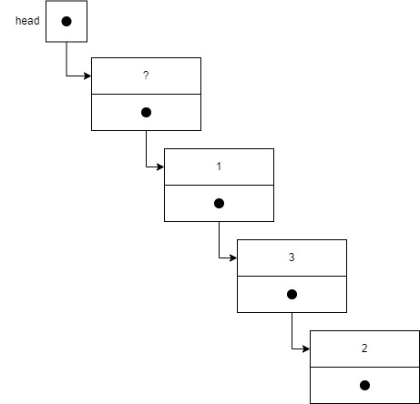

# Handin week 6

## Exercise 1
the answers are the following:
x=7, y=18, z=2

## Exercise 3

### a)
The first list looks like this:



the second list looks like this:


### c)

The code will get stuck in an infinte loop, printing the first element in the list. So the post condition is not fulfiled.

### d)

```c
void printout(node *l)
{
  /*pre: head points to the first, empty element. The last element's next is NULL
    post: the values of the list are printed out*/
  node *p = l->next;
  while (p != NULL)
  {
    printf("%d, ", p->data); //prints the data at the current element 
    p = p->next; //moves through the list
  }
  printf("\n");
}
```

## challenge
[code](https://github.com/Sebbekarl/challenge)
not many comments but here's the code